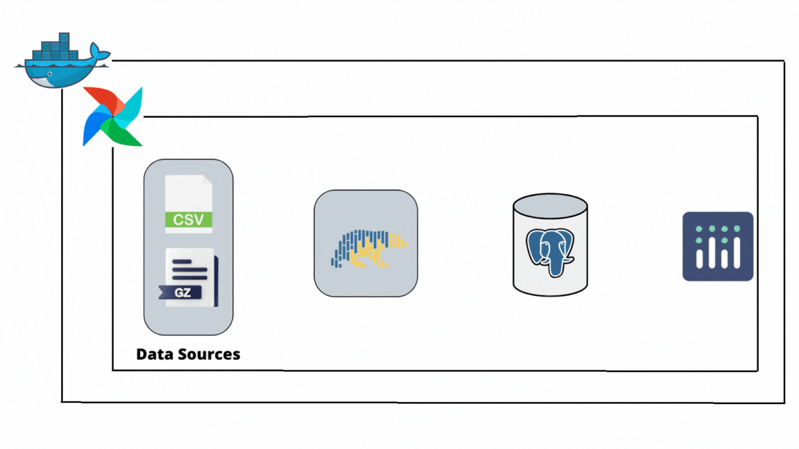

# Technical Documentation

Written by [Charles Phonepraseuth](https://www.linkedin.com/in/charlesphonepraseuth/)

This document covers ETL pipeline project in details.
If you want to going through the code, the entrypoint is `/app/pipeline/dags/hotel_etl_dag.py`.

# Table of Contents

- [Technical Documentation](#technical-documentation)
- [Table of Contents](#table-of-contents)
- [Data Sources and Destinations](#data-sources-and-destinations)
  - [Accommodations Dataset](#accommodations-dataset)
    - [Source: Website 1](#source-website-1)
    - [Destination: Raw Accommodations Data](#destination-raw-accommodations-data)
  - [Addresses Dataset](#addresses-dataset)
    - [Source: Website 2](#source-website-2)
    - [Destination: Raw Addresses Data (Multiple Files)](#destination-raw-addresses-data-multiple-files)
- [Transformations](#transformations)
- [Data Loading](#data-loading)
- [Database Schema](#database-schema)
- [Data Analysis](#data-analysis)
- [Limitations](#limitations)



# <a id="data-sources-and-destination"></a>Data Sources and Destinations

## Accommodations Dataset

### Source: Website 1

- **Description**: This dataset provides information about classified collective accommodations in France.
- **Source URL**: [Accommodations Dataset
](https://www.data.gouv.fr/fr/datasets/hebergements-collectifs-classes-en-france/)
- **File Format**: `CSV`

### Destination: Raw Accommodations Data

- **Description**: This is the raw dataset obtained from the accommodations source. It will be stored in its original format.
- **File Name**: `hebergements-collectifs-classes-en-france.csv`
- **Storage Location**: `/app/data/external/accommodations/`
- **Data Format**:

```
DATE DE CLASSEMENT;DATE DE PUBLICATION DE L'�TABLISSEMENT;TYPE D'H�BERGEMENT;CLASSEMENT;CAT�GORIE;MENTION;NOM COMMERCIAL;ADRESSE;CODE POSTAL;COMMUNE;T�L�PHONE;COURRIEL;SITE INTERNET;TYPE DE S�JOUR;CAPACIT� D'ACCUEIL (PERSONNES);NOMBRE DE CHAMBRES;NOMBRE D'EMPLACEMENTS;NOMBRE D'UNIT�S D'HABITATION;NOMBRE DE LOGEMENTS
23/12/2016;-;H�TEL DE TOURISME;3 �toiles;-;-;ARC H�TEL SUR MER;89 boulevard de la Plage;33120;ARCACHON;05 56 83 06 85 ;reservation@arc-hotel-sur-mer.com;http://www.arc-hotel-sur-mer.com;-;64;30;-;-;-
04/11/2014;-;H�TEL DE TOURISME;2 �toiles;-;-;H�TEL DE L'OC�AN;36 cours des Dames;17000;LA ROCHELLE;05 46 41 31 97 ;ocean.hotel@wanadoo.fr;www.hotel-ocean-larochelle.com;-;40;15;-;-;-
```

## Addresses Dataset

### Source: Website 2

- **Description**: This dataset provides information about addresses in France.
- **Source URL**: [Addresses Dataset](https://adresse.data.gouv.fr/data/ban/adresses/latest/csv/)
- **File Format**: `GZipped CSV`

### Destination: Raw Addresses Data (Multiple Files)

- **Description**: This is the raw dataset obtained from the addresses source. It will be decompressed and stored in CSV format.
- **File Names**: `lieux-dit-01-beta.csv`, `adresses-01.csv`, ...
- **Storage Location**: `/app/data/external/adress/csv/`
- **Data Format**:

```
id;id_fantoir;numero;rep;nom_voie;code_postal;code_insee;nom_commune;code_insee_ancienne_commune;nom_ancienne_commune;x;y;lon;lat;type_position;alias;nom_ld;libelle_acheminement;nom_afnor;source_position;source_nom_voie;certification_commune;cad_parcelles
01002_w4ld4h_00006;;6;;Place du Pese Lait;01640;01002;L'Abergement-de-Varey;;;887643.67;6547960.53;5.425179;46.005447;entrée;;;ABERGEMENT-DE-VAREY (L );PLACE DU PESE LAIT;commune;commune;1;01002000AE0005
01002_6zbsct_01082;;1082;;Chemin de la Ferm de la Montagne;01640;01002;L'Abergement-de-Varey;;;888177.96;6546947.6;5.431677;45.996182;entrée;;;ABERGEMENT-DE-VAREY (L );CHEMIN DE LA FERM DE LA MONTAGNE;commune;commune;1;010020000B0888
```

----

# <a id="transformations"></a>Transformations

The tool used for transformations is Polars, because it can handle datasets (millions rows) that are larger than the available RAM in your machine (in that case, mine with 8Go).
We want to merge both type of datasets to get only hotel informations and localizations. To be able to do that, we use columns relative to adresses and then concatenate them.

> Example:
>
> - From accommodations:
>
> | <div style="width:180px">ADRESSE</div> | <div style="width:120px">CODE POSTAL</div> | COMMUNE  | concat                                  |
> |----------------------------------------|--------------------------------------------|----------|-----------------------------------------|
> | 89 boulevard de la Plage               | 33120                                      | ARCACHON | 89+boulevard+de+la+Plage+33120+arcachon |
>
> - From adresses (streets):
>
> | numero | rep | <div style="width:110px">nom_voie</div> | code_postal  | nom_commune | concat                           |
> |--------|-----|-----------------------------------------|--------------|-------------|----------------------------------|
> | 4      | bis | Avenue Mireille                         | 06100        | Nice        | 4+bis+avenue+mireille+06100+nice |
>
> - From adresses (places):
>
> | <div style="width:180px">nom_lieu_dit</div> | <div style="width:120px">code_postal</div> | nom_commune | concat                    |
> |---------------------------------------------|--------------------------------------------|-------------|---------------------------|
> | Greffets Sud                                | 01140                                      | Viriat      | greffets+sud+01140+viriat |
>

By the way, we apply some transformations to french date columns from accommodations datasets to unified process.

> From `02/11/2017` to `2017-11-02`

And `CLASSEMENT` (*rating*) column to be usable.

> From "`3 étoiles`" to `3`

The following code snippets illustrate the transformations with Polars:

```py
df_clean = df.filter(pl.col("TYPE D'HÉBERGEMENT") == accommodations_type) \
             .fill_null(value="") \
             .with_columns([
                 pl.col("CLASSEMENT").apply(lambda x: x[:1]) \
                                     .cast(pl.Int64),
                 (pl.col("DATE DE CLASSEMENT") \
                    .str.strptime(pl.Date, format="%d/%m/%Y") \
                    .cast(pl.Utf8)).alias("date"),
                 pl.col("DATE DE CLASSEMENT") \
                   .str.strptime(pl.Date, format="%d/%m/%Y") \
                   .dt.day().cast(pl.Int64).alias("day"),
                 pl.col("DATE DE CLASSEMENT") \
                   .str.strptime(pl.Date, format="%d/%m/%Y") \
                   .dt.month().cast(pl.Int64).alias("month"),
                 pl.col("DATE DE CLASSEMENT") \
                   .str.strptime(pl.Date, format="%d/%m/%Y")\
                   .dt.year().cast(pl.Int64).alias("year"),
                 pl.col("NOM COMMERCIAL").str.to_lowercase(),
                 pl.col("ADRESSE").str.to_lowercase(),
                 pl.col("COMMUNE").str.to_lowercase(),
                 pl.concat_str(column_to_concat, separator="+") \
                   .str.replace_all(r"\s", "+") \
                   .str.replace_all(r"\++", "+") \
                   .str.to_lowercase() \
                   .alias("concat")
             ])
```

Once merge finished, we select specific columns and save the transformed data into a new CSV file named `preprocessed_data.csv`.

> As following:
>
> | <div style="width:90px">name</div> | room | capacity | <div style="width:70px">adress</div> | zip   | city    | star | <div style="width:90px">date</div> | day | month | year | latitude  | longitude | x         | y          | concat                   |
> |------------------------------------|------|----------|--------------------------------------|-------|---------|------|------------------------------------|-----|-------|------|-----------|-----------|-----------|------------|--------------------------|
> |hôtel muret                         | 19   | 42       | le village                           | 05130 | sigoyer | 3    | 2017-06-20                         | 20  | 6     | 2017 | 44.477565 | 5.97663   | 936688.03 | 6379851.51 | le+village+05130+sigoyer |

----

# <a id="data-loading"></a>Data Loading

The transformed data is loaded into the target database. The ETL pipeline automates this process, ensuring that data is correctly mapped and inserted into the destination tables in **idempotent** way following the **Star schema** from Kimball detailed in [database schema](#database-schema).
If you need to re-run the loading step, it should produce the same results without causing data duplication.

----

# <a id="database-schema"></a>Database Schema

<div style="text-align:center">

  

</div>

This database schema follows the Kimball Star Schema methodology, a widely used approach in data warehousing. It is designed to efficiently store and retrieve data for analytical purposes. The schema comprises of four dimension tables (dim_info, dim_adress, dim_location, dim_date) and one fact table (fact_hotel). Each dimension table contains specific attributes related to the respective entity, while the fact table holds key references to the dimensions.

The fact table acts as a central hub that connects to various dimensions, allowing for efficient querying and analysis based on different attributes.

This database schema is designed to facilitate analytical processes, providing a structured and optimized environment for reporting and data analysis on accommodations and related information.

----

# <a id="data-analysis"></a>Data Analysis

If you need to do some SQL queries for data analysis, you can perform this with the following code snippets on notebooks:

```py
# Create an engine to connect to your PostgreSQL database
connection = DatabaseConnection(**helper.get_db_creds())

# Which region be a part of top 10
# with most hotel who star rating
# above national average per region ?
query = """
    WITH region AS (
        SELECT
                id,
                LEFT(zip, 2) AS num
            FROM dim_adress
    ),
    avg_star AS (
        SELECT
            ROUND(AVG(star), 2) AS value
        FROM fact_hotel
    ),
    hotel_data AS (
        SELECT
            region.num AS region_num,
            COUNT(CASE WHEN fh.star > avg_star.value THEN 1 END) as hotel_count,
            DENSE_RANK() OVER (ORDER BY COUNT(CASE WHEN fh.star > avg_star.value THEN 1 END) DESC) AS region_rank
        FROM fact_hotel AS fh
        JOIN region ON fh.adress_id = region.id, avg_star
        GROUP BY region.num
    )
    SELECT
        region_num,
        hotel_count,
        region_rank
    FROM hotel_data
    WHERE region_rank <= 10;
"""

result = connection.read_sql(query)
print(result)

#    region_num  hotel_count  region_rank
# 0          06          211            1
# 1          74          169            2
# 2          92           88            3
# 3          64           87            4
# 4          67           86            5
# 5          65           77            6
# 6          83           73            7
# 7          44           70            8
# 8          21           70            8
# 9          35           67            9
# 10         68           64           10
```

# <a id="limitations"></a>Limitations

While developing this project, it's important to note that certain methods and tools, specifically those involving ConnectorX, were not accessible due to technical constraint within our environment. As a result, alternative approaches were implemented to achieve similar outcomes. These adjustments may lead to slight differences in the workflow compared to the ideal scenario.

We understand the significance of ConnectorX and its potential benefits. However, given our current infrastructure, we had to make decisions that best aligned with our project's objectives. If future developments allow for the integration of ConnectorX, we will reassess its inclusion in subsequent iterations.

In details, Polars can apply some transformations, fetch, insert data and more...
Because of our limitation, we're able to insert data with it through Arrow and PyArrow who are installed from Dockerfile and requirements.txt. But unfortunately, we cannot fetch data with Polars due to missing ConnectorX, that's why we make a choice to use Pandas for this part.  

We appreciate your understanding and are committed to continuously improving our processes and technologies to enhance our projects.
